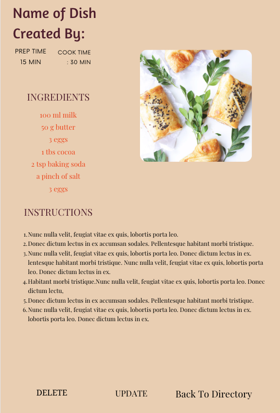
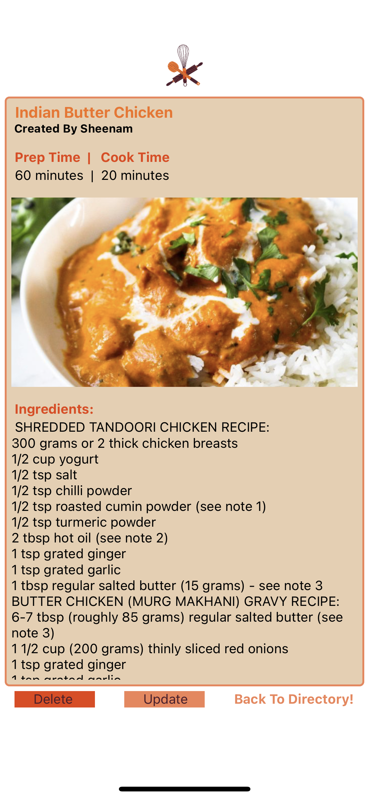
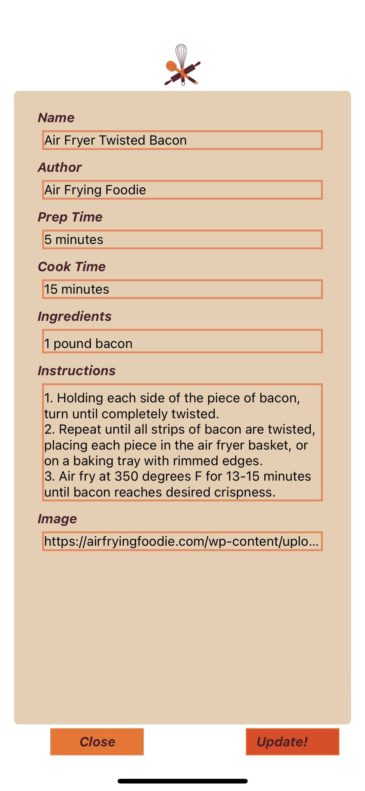

# capstone-frontend-whiskIt

Recipes are passed down through families and around with friends throughout our lives, but are we getting to them efficiently? Now we can. With WhiskIt!, we are able to store, add, and update our favorite recipes without having to read the novel that inspired it. 

## Logo

## Expo Go QR Code

## Wireframe

## Screenshots

   

## Model
`Recipe = {
    name: String,
    author: String,
    prepTime: String,
    cookTime: String,
    ingredients: String,
    instructions: String,
    image: String,
}`

## Technology
MongoDb\
Node.js\
Express\
ReactNative\

## Future Enhancements
FUTURE As a user, I can log in and store my favorite recipes to my personal recipe directory\
FUTURE As a user, I can share a recipe via email/text \
FUTURE As a user, I can reply to a comment or review on a recipe